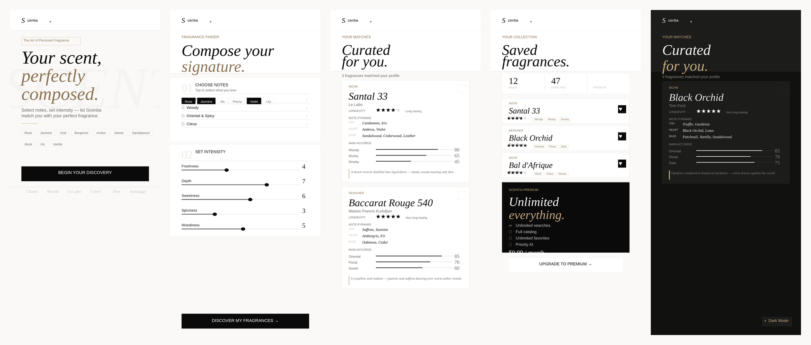

<p align="center">
  
</p>

<p align="center"><b>AI-powered fragrance discovery: pick the notes you love, tune the intensity and get perfumes curated for you.</b></p>

<p align="center">
  
  
  
  
  
  
</p>

---

Scentia is a full-stack mobile product with three parts: an **iOS/Android app** built with React Native + Expo, a **serverless Firebase backend** that calls Claude to generate personalised fragrance recommendations, and a **Next.js admin panel** for users, catalog, subscriptions and analytics.



## Features

**Mobile app**
- **Fragrance Finder.** Choose favourite notes (floral, woody, oriental and spicy, citrus…) and set five intensity dimensions: freshness, depth, sweetness, spiciness and woodiness. You can also filter by niche or designer and by season.
- **AI results.** Each match comes with its note pyramid (top / heart / base), main accords with percentages, a longevity rating and a short description.
- **Favorites & history.** Save fragrances to a personal collection and review past searches.
- **Subscriptions.** Free, Essential and Premium plans via Stripe, with plan-based search limits enforced on the server.
- **Growth features.** Referral program, share cards, affiliate "buy" links (Amazon, Notino) and push notifications.
- **Polish.** Light and dark themes, i18n, skeleton loaders, error boundaries, haptics, and email, Google and Apple sign-in.

**Backend (Firebase Cloud Functions)**
- `findFragrances`: an authenticated, rate-limited callable that validates input with Zod, prompts Claude and validates the structured JSON output.
- Stripe: `createSubscription`, `cancelSubscription`, `getSubscriptionStatus` and a signed `stripeWebhook`.
- Scheduled pushes (weekly recommendations, re-engagement), Firestore triggers and user-data cleanup on account deletion.
- Firestore and Storage security rules plus composite indexes.

**Admin panel (Next.js)**
- Dashboard, user management, fragrance catalog, subscriptions and MRR, and growth analytics built with Recharts.

## Architecture

```
┌──────────────────────┐      callable / HTTPS      ┌──────────────────────────────┐
│  Mobile app (Expo)   │ ─────────────────────────▶ │  Firebase Cloud Functions    │
│  React Native + TS   │                            │  • findFragrances ──▶ Claude │
│  Zustand, React Query│ ◀── Firestore / Auth ────▶ │  • Stripe billing + webhook  │
└──────────────────────┘                            │  • scheduled push, triggers  │
                                                    └──────────────┬───────────────┘
┌──────────────────────┐                                           │
│  Admin panel (Next)  │ ◀──────────── Firestore ─────────────────┘
└──────────────────────┘
```

API keys for Anthropic and Stripe **never ship in the client**. They are stored as Firebase Functions secrets, and the app talks to them only through authenticated callables.

## Repository structure

```
app/        React Native + Expo app (expo-router)
  app/        screens: (auth), (tabs), results, checkout, referral, fragrance/[id]
  src/        services (Firebase, AI, Stripe, affiliate…), store, hooks, theme, i18n, components
backend/    Firebase Cloud Functions (TypeScript), Firestore & Storage rules
admin/      Next.js admin panel
assets/     logos, app icons, App Store screenshots and splash screens
docs/       README screenshots and the full Turkish setup & release guide
```

## Getting started

Prerequisites: Node.js 18+, a Firebase project on the Blaze plan, a Stripe account and an Anthropic API key.

```bash
git clone https://github.com/Atlass000/scentia.git
cd scentia

# 1. Backend
npm install -g firebase-tools && firebase login && firebase use --add
firebase functions:secrets:set ANTHROPIC_API_KEY
firebase functions:secrets:set STRIPE_SECRET_KEY
firebase functions:secrets:set STRIPE_WEBHOOK_SECRET
cd backend && npm install && npm run build && cd ..
firebase deploy --only firestore,functions

# 2. Mobile app
cd app
npm install
cp .env.example .env.local      # fill in Firebase + Stripe publishable values
npx expo start                  # press i / a, or scan the QR code with Expo Go

# 3. Admin panel
cd ../admin
npm install
cp .env.example .env.local
npm run dev
```

For the full step-by-step setup, including Stripe products, webhooks, EAS builds and App Store / Play Store submission, see **[docs/SETUP_TR.md](docs/SETUP_TR.md)** (Turkish).

## Tech stack

| Area | Technologies |
|---|---|
| Mobile | React Native 0.74, Expo 51, expo-router, TypeScript, Zustand, TanStack Query, MMKV, Reanimated, react-native-svg |
| Backend | Firebase Cloud Functions v2, Firestore, Auth, Storage, Anthropic SDK, Stripe, Zod |
| Admin | Next.js 14, React 18, Recharts, firebase-admin |
| Delivery | EAS Build & Submit, Vercel |

## Author

**Mohammed Mustafa Kareem**, Software Engineering, OSTIM Technical University

## License

© 2026 Mohammed Mustafa Kareem. All rights reserved. The source is published for portfolio and review purposes.
